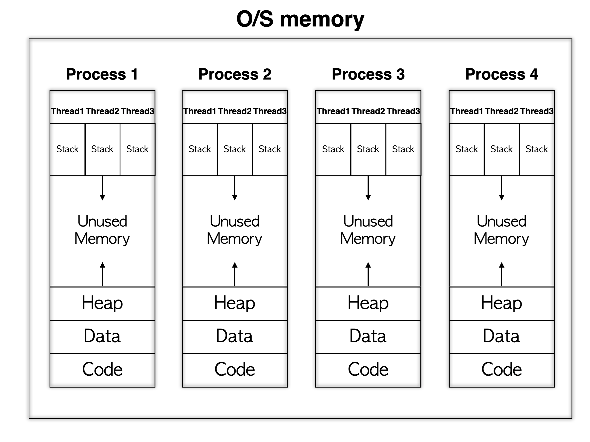

# 프로세스 & 스레드

---

## 1. 기본 개념

### 프로세스(Process)

- **정의**: 메모리에 적재되어 실행 중인 프로그램
- **특징**:
  - **독립적 주소 공간**: 프로세스마다 독자적인 메모리 공간(Code, Data, Heap, Stack)을 할당받는다.
  - **최소 스레드 보유**: 각 프로세스는 최소 1개의 메인 스레드를 포함한다.

### 스레드(Thread)

- **정의**: 프로세스 내부에서 실행되는 독립적인 실행 흐름 단위
- **특징**:
  - **공유 메모리**: 스레드는 프로세스 내의 Code, Data, Heap 영역을 다른 스레드와 공유하며, 각자의 Stack만 독립적으로 할당받는다.
  - **독립 실행**: 함수 호출 시 독립적인 Stack과 프로그램 카운터(PC)를 갖추어 별도의 실행 흐름을 유지한다.

---

## 2. 메모리 영역 구성

프로세스는 다음과 같은 메모리 영역으로 구성된다.

- **Code**: 프로그램의 실행 명령어를 저장하는 영역.
- **Data**:
  - **초기화된 데이터**: Data 영역에 저장.
  - **초기화되지 않은 데이터**: BSS 영역에 저장.
- **Heap**: 동적 메모리 할당(new, malloc 등)에 사용.
- **Stack**: 지역 변수, 매개 변수, 반환 값 등 임시 데이터를 저장하는 영역.

스레드는 Stack을 별도로 할당받고, 그 외의 메모리 영역은 프로세스 내 다른 스레드와 공유한다.

---

## 3. 멀티프로세스와 멀티스레드

### 멀티프로세스

- **정의**: 하나의 프로그램을 여러 프로세스로 구성하여 병렬적으로 작업을 처리.
- **장점**:
  - 메모리 침범 문제를 운영체제 차원에서 해결하여 안전성이 높음.
- **단점**:
  - 각 프로세스가 독립된 메모리를 가지므로 오버헤드가 증가.
  - **Context Switching**: 프로세스 간 전환 시 상태 정보를 저장 및 복원하는 과정에서 성능 저하가 발생할 수 있음.

### 멀티스레드

- **정의**: 하나의 프로그램을 여러 스레드로 구성하여 각 스레드가 개별 작업을 처리.
- **장점**:
  - 스레드 간 공유 메모리를 통해 시간 및 자원 손실이 적으며, 전역 변수와 정적 변수 공유가 가능.
- **단점**:
  - 공유 메모리 사용으로 인한 안전성 문제 발생 가능.
  - **Critical Section**: 하나의 스레드가 공유 데이터를 변경하는 동안 다른 스레드가 접근하지 못하도록 동기화 기법을 적용하여 문제를 해결함.
  - 동기화 기법: **Mutex**, **Semaphore**, **Spin Lock** 등

---

## 4. 프로세스 제어 블록 (PCB)

**프로세스 제어 블록 (Process Control Block, PCB)** 은 각 프로세스의 중요한 정보를 저장하는 운영체제의 자료 구조로, 프로세스 생성 시 자동으로 생성됨.

### PCB에 저장되는 정보

- **프로세스 식별자 (PID)**: 고유 식별 번호.
- **프로세스 상태**: new, ready, running, waiting, terminated 등.
- **프로그램 카운터 (PC)**: 다음에 실행할 명령어의 주소.
- **CPU 레지스터**: 현재 CPU 상태 정보.
- **CPU 스케줄링 정보**: 우선순위, 스케줄 큐 포인터 등.
- **메모리 관리 정보**: 페이지 테이블, 세그먼트 테이블 등.
- **입출력 상태 정보**: 할당된 입출력 장치 및 열린 파일 목록.
- **어카운팅 정보**: 사용된 CPU 시간, 시간제한, 계정 번호 등.

---

## 5. 스레드의 구성 요소

스레드는 프로세스 내에서 실행되는 독립적인 실행 흐름을 보장하기 위해 다음과 같은 요소로 구성된다.

- **스레드 ID**: 각 스레드의 고유 식별자.
- **프로그램 카운터 (PC)**: 현재 실행 위치를 나타냄.
- **레지스터 집합**: 작업에 필요한 레지스터 정보.
- **스택**: 함수 호출 시 전달되는 인자, 반환 주소, 지역 변수 등 임시 데이터를 저장하는 독립 메모리 영역.

**스택과 PC 레지스터의 독립 할당 이유**:  
스택은 함수 호출, 지역 변수 저장 등 독립적인 실행 흐름에 필수적이며, PC는 스레드가 중단된 위치를 기억하여 재개할 수 있도록 하기 위함.

---
