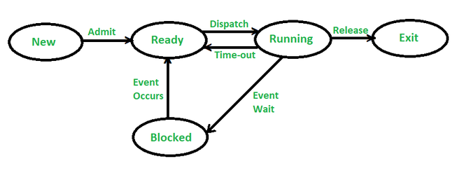

# OS

## Scheduling

- 자원을 할당받을 프로세스를 결정하는 과정
- Process 5-state model
 
- 다음 경우에 발생
  1. Running -> Blocked (Waiting)
  2. Running -> Ready
  3. Blocked (Waiting) -> Ready
  4. Exit(Terminated)

  이 중 1, 4번에서만 발생할 경우 비선점 (non-preemptive), 네 가지 전부에서 발생할 경우 선점 (preemptive) 스케줄링이라 한다.

## 알고리즘

### First Come First Served (FCFS, FIFO)

- 가장 간단한 비선점 스케줄링 방법
- 작업 큐에 도착한 순서대로 실행한다.
- 작업 순서에 따라 콘보이 효과가 발생 할 수 있다.
  - 콘보이 효과: 하나의 긴 작업이 CPU를 오래 점유하여 뒤에 대기하는 짧은 작업들이 오래 기다리게 되는 현상

### Shortest Job First (SJB)

- 비선점
- 실행 시간(burst time)이 짧은 프로세스부터 실행
- 어떤 프로세스가 계속 자원 할당을 받지 못하는 Starvation 발생 가능

### Shortest Remaining Time First (SRTF)

- 선점형
- 남은 시간이 가장 짧은 프로세스부터 실행
- Starvation 발생 가능

### Priority Scheduling

- 선점형, 비선점형
- 선점형의 경우 Starvation 발생 가능
  - 오래 대기한 프로세스의 우선순위를 높여서 해결 가능 (aging)

### Round Robin (RR)

- 선점형
- 일정한 시간 간격동안만 프로세스를 처리하고 남은 작업은 큐의 맨 뒤로 보냄

### Multilevel Feedback Queue

- 선점형
- 우선순위가 다른 여러개의 큐를 사용
- 프로세스는 다른 큐로 이동 가능
