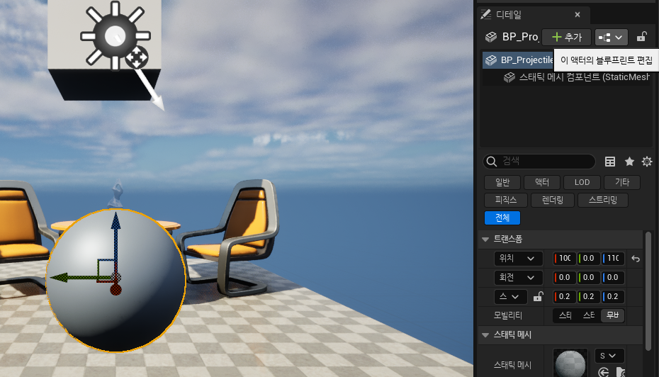
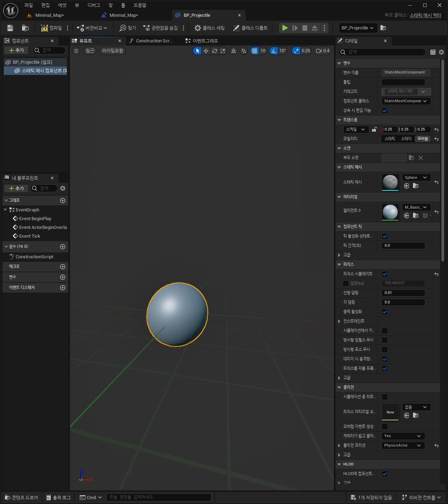
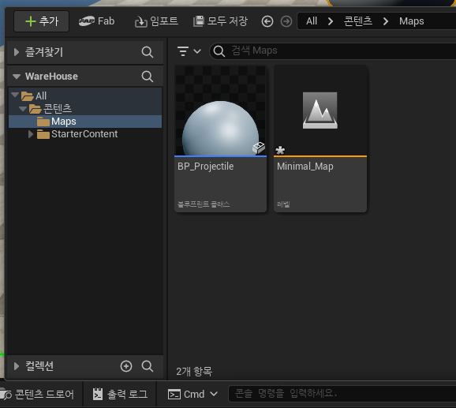
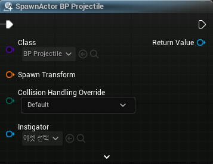
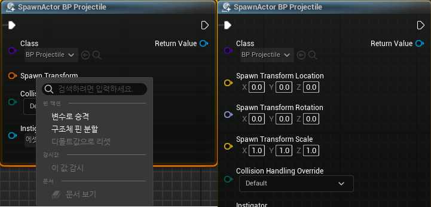
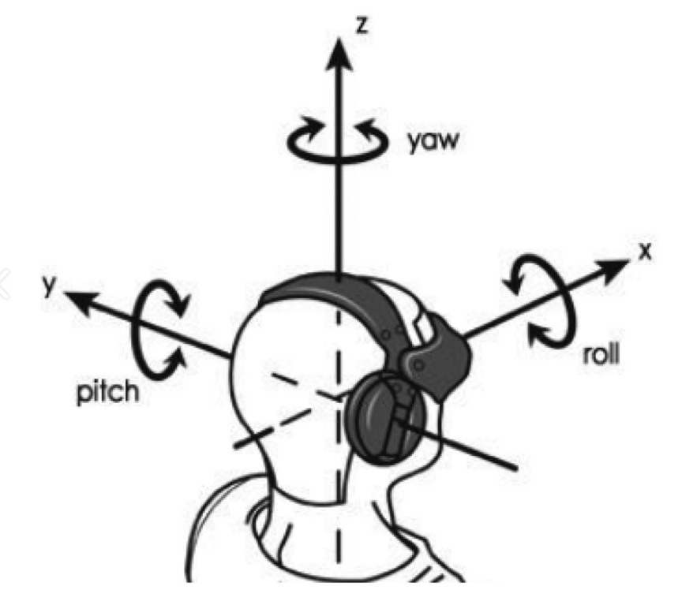

# Lecture Note

Udemy 강의 (<https://www.udemy.com/course/unrealcourse-korean/>)

## Object

- 데이터와 기능의 집합
- 액터: 레벨에 들어가는 오브젝트
- 컴포넌트: 액터에 들어가는 오브젝트
- 블루프린트에서 참조 방법
  - 화면 안의 액터 선택 후 BP의 이벤트 그래프에서 우클릭 후 `Create a Reference` 선택
- Data Pin: BP 노드의 In/Out
- Execution Pin: 노드의 실행 흐름

## BP & Instance

액터 선택 후 오른쪽의 디테일 혹은 툴바에서 BP 클래스로 변환 가능하다.

BP 편집 화면에서 해당 클래스의 여러 속성들을 편집할 수 있으며

컨텐츠 드로어에서 씬에 드래그하는 식으로 해당 BP클래스의 인스턴스를 생성할 수 있다.

## Spawn BP

class : 스폰할 액터의 클래스

transform : location, rotation, scale

collision : 스폰 지점 충돌 처리

instigator : 이벤트 리스너

여러 데이터 타입이 결합된 핀의 경우, 우클릭해서 핀 분할을 통해 세부 타입으로 분리할 수 있다.

SpawnActor는 스폰한 인스턴스의 참조를 반환한다. 해당 참조를 이용해 추가적인 작업이 가능하다.

## Control Rotation

- Get Control Rotation : 컨트롤러의 회전 벡터를 반환한다.
- Get Forward Vector : 회전 벡터를 정면 벡터로 변환환다.
  - Forward Vector: 객체의 정면 방향을 월드 좌표계에서 나타낸 **단위 벡터**
  - Rotator : 객체의 회전을 표한하는 벡터  
  - 물체를 기준으로 바라봤을 때 좌우 회전(Z축 중심)을 Yaw, 상하 회전(Y축 중심)을 Pitch, 물체의 수평 기울기(X축 중심)을 Roll이라고 한다.

## Pure Function

- side effect가 없는 함수
- BP 상에서 실행 핀이 없는 함수